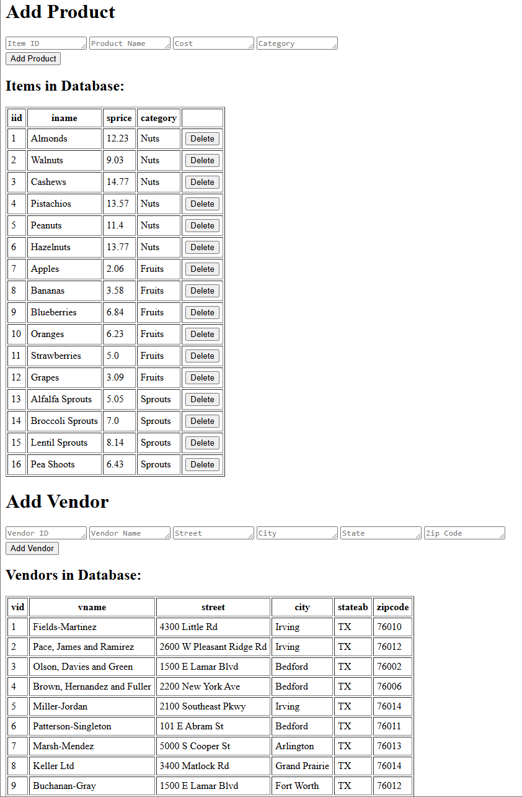
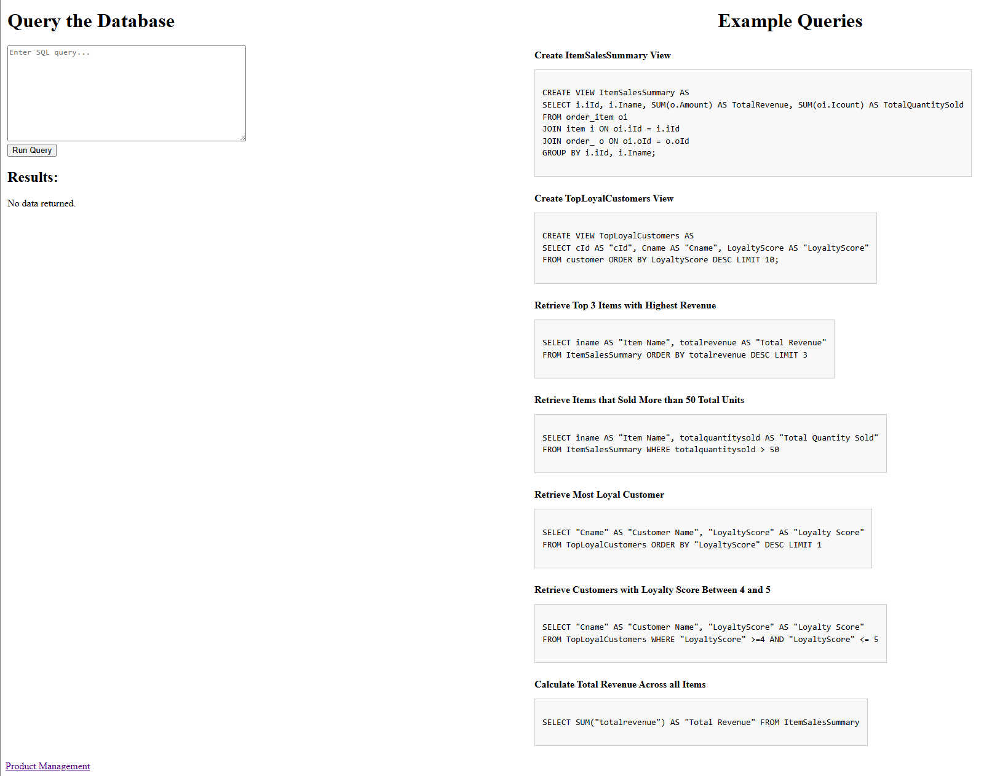

# Arlington Organic Market
Juan Guajardo Gutierrez - 1002128662

Ghiya El Daouk El Kadi - 1002165392

A web interface to query the Arlington Organic Market database. Currently only deployed locally.

To access the interface, first install the requirements:

`pip install -r requirements.txt`

Note that it is assumed that you have a local postgres database with the data you want to query. In `backend.py`, replace

```
conn = psycopg2.connect(
    host="localhost",
    database="Organic Market DB",
    user="postgres",
    password="1234"
)
```

with your postgres database's credentials.

Then run the backend: 

`python backend.py` 

Finally, use your browser to head to [http://127.0.0.1:5000](http://127.0.0.1:5000)

You will be taken to the Product Management page, which looks like this:


This page provides a user friendly interface to perform actions such as adding a product or deleting a product,
adding a vendor, linking a vendor to an item, and updating an item's price. Several tables including one with
the store's inventory are displayed and automatically updated to help you visusalize the results of your actions.

A link to the Database Query page can be found at the bottom of the Product Management page. The Database
Query page allows you to enter any query to be executed against the database. Results will be shown as a table
to make it easier to visualize them. Some example queries can be found on the right half of the page, as seen below:

